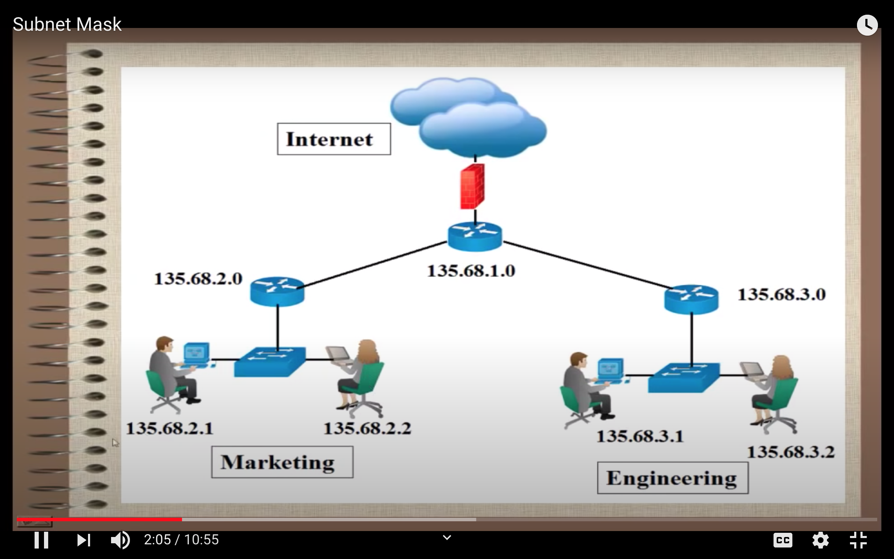
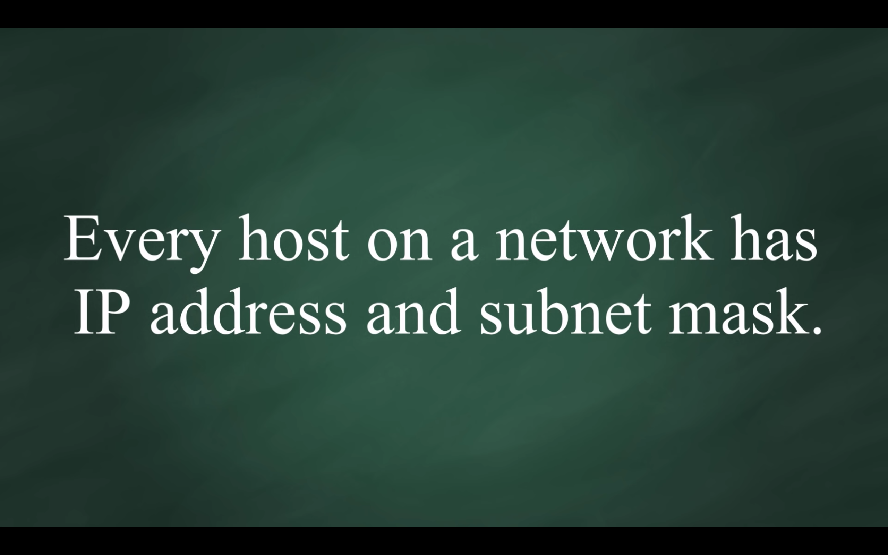
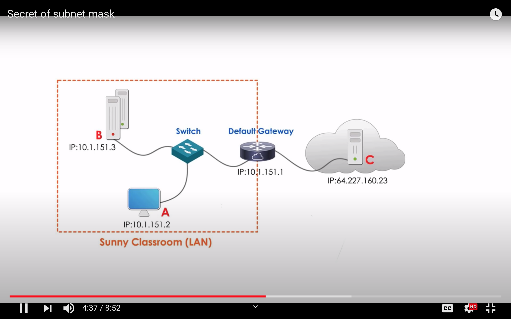
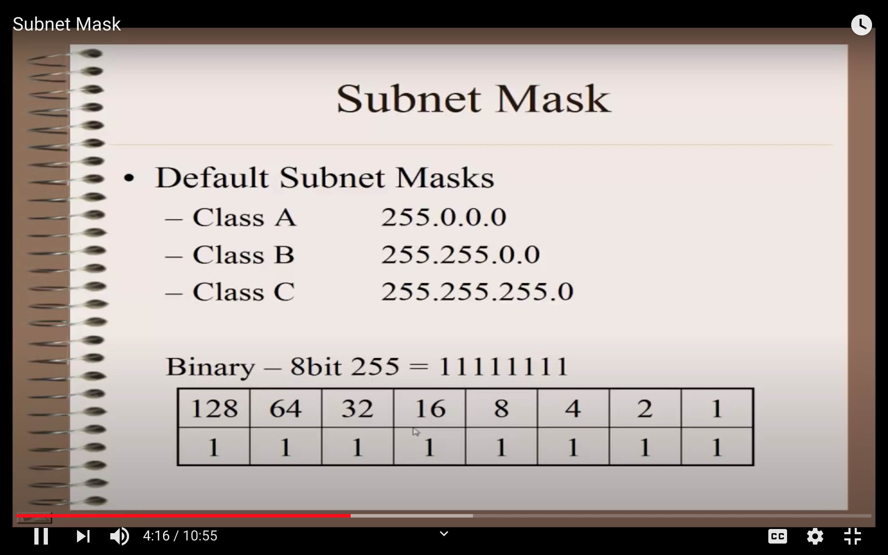
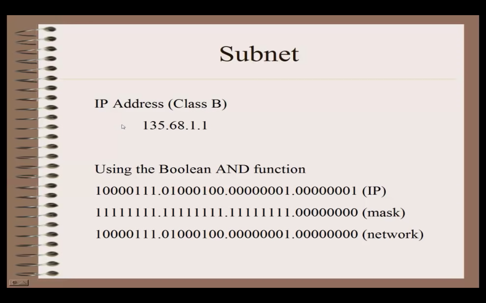

# Network IP Address vs Node IP Address
- Network IP address ends with `0`

# Subnet mask
- Used by node to identify other node ip address falls into same local network or outside of network 

- Subnet mask is used to identify the ip address of network address

# CIDR

